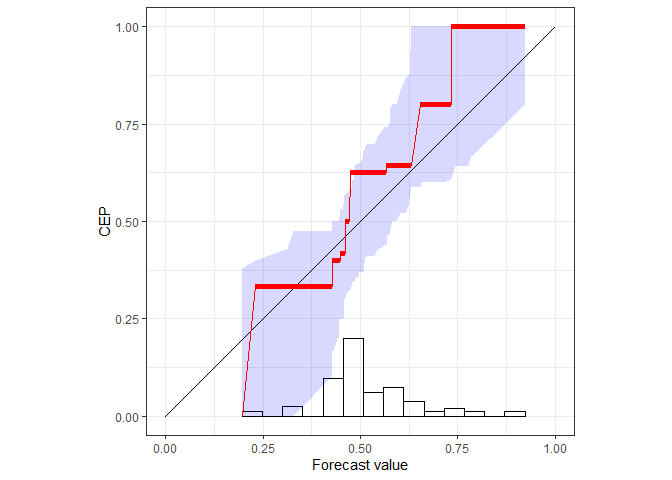

# reliabilitydiag

This package implements reliability diagrams via the CORP approach,
which generates provably statistically Consistent, Optimally binned, and
Reproducible reliability diagrams in an automated way.

CORP is based on non-parametric isotonic regression and implemented via
the Pool-adjacent-violators (PAV) algorithm - essentially, the CORP
reliability diagram shows the graph of the PAV- (re)calibrated forecast
probabilities. The CORP approach allows for uncertainty quantification
via either resampling techniques or asymptotic theory, furnishes a new
numerical measure of miscalibration, and provides a CORP based Brier
score decomposition that generalizes to any proper scoring rule.

## Installation

``` r
# Install development version from GitHub
devtools::install_github("aijordan/reliabilitydiag")
```

## Example

``` r
library(reliabilitydiag)

set.seed(42)
X <- runif(100)
Y <- rbinom(100, 1, X)
reliabilitydiag(X, y = Y)
```

<!-- -->

    #> 'brier' score decomposition (see also ?summary.reliabilitydiag)
    #> # A tibble: 1 x 5
    #>   forecast mean_score miscalibration discrimination uncertainty
    #>   <chr>         <dbl>          <dbl>          <dbl>       <dbl>
    #> 1 X             0.153         0.0242          0.120       0.249
