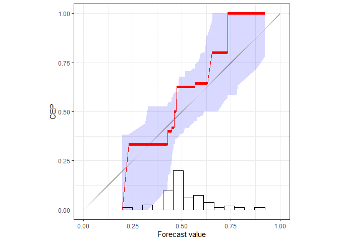

# reliabilitydiag

## Reliability Diagrams Using Isotonic Regression

Checking the reliability of predictions via the CORP approach, which
generates provably statistically **C**onsistent, **O**ptimally binned,
and **R**eproducible reliability diagrams using the
**P**ool-adjacent-violators algorithm. See Dimitriadis, Gneiting, Jordan
(2020), available at
[arXiv:2008.03033](https://arxiv.org/abs/2008.03033).

CORP is based on non-parametric isotonic regression and implemented via
the Pool-adjacent-violators (PAV) algorithm - essentially, the CORP
reliability diagram shows the graph of the PAV- (re)calibrated forecast
probabilities. The CORP approach allows for uncertainty quantification
via either resampling techniques or asymptotic theory, furnishes a new
numerical measure of miscalibration, and provides a CORP based Brier
score decomposition that generalizes to any proper scoring rule.

## Installation

reliabilitydiag is available on [The Comprehensive R Archive Network
(CRAN)](https://cran.r-project.org/).

``` r
install.packages("reliabilitydiag")
```

### Development version

The most current version including bug fixes and new features is
available from GitHub.

``` r
# install.packages("devtools")
devtools::install_github("aijordan/reliabilitydiag")
```

## Example

``` r
library(reliabilitydiag)
data("precip_Niamey_2016", package = "reliabilitydiag")

X <- precip_Niamey_2016$EMOS
Y <- precip_Niamey_2016$obs
reliabilitydiag(EMOS = X, y = Y)
```

<!-- -->

    #> 'brier' score decomposition (see also ?summary.reliabilitydiag)
    #> # A tibble: 1 x 5
    #>   forecast mean_score miscalibration discrimination uncertainty
    #>   <chr>         <dbl>          <dbl>          <dbl>       <dbl>
    #> 1 EMOS          0.232         0.0183         0.0305       0.244
